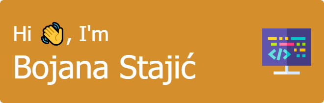

It's me, Bojana Stajić, and I'm so excited to meet you, world! I'm a passionate Software engineering student from Serbia, always excited to learn new stuff and never afraid to revise old ones.

- 🔭 I’m currently working on improving my old projects
- 🌱 I’m currently learning Python
- ⚡ Fun fact: I laugh at my own jokes

### :hammer_and_wrench: Languages and Tools :

&nbsp;
&nbsp;
  &nbsp;
  &nbsp;
  &nbsp;
    &nbsp;
    &nbsp;
   &nbsp;
   &nbsp;
  &nbsp;
   &nbsp;
   &nbsp;
    &nbsp;
   &nbsp;
     &nbsp;
      &nbsp;
        &nbsp;

### :fire: My Stats :

    
   
   
   
